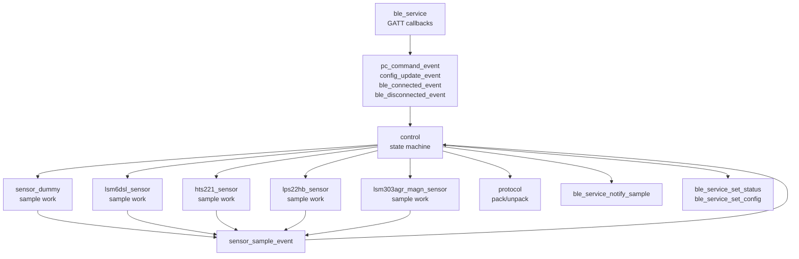
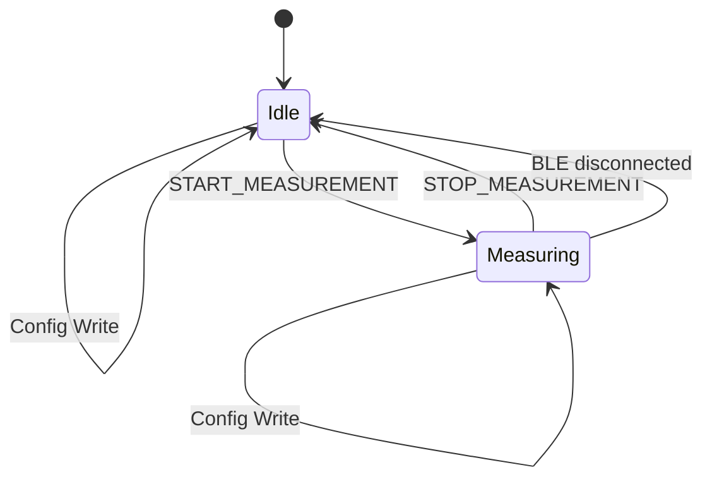
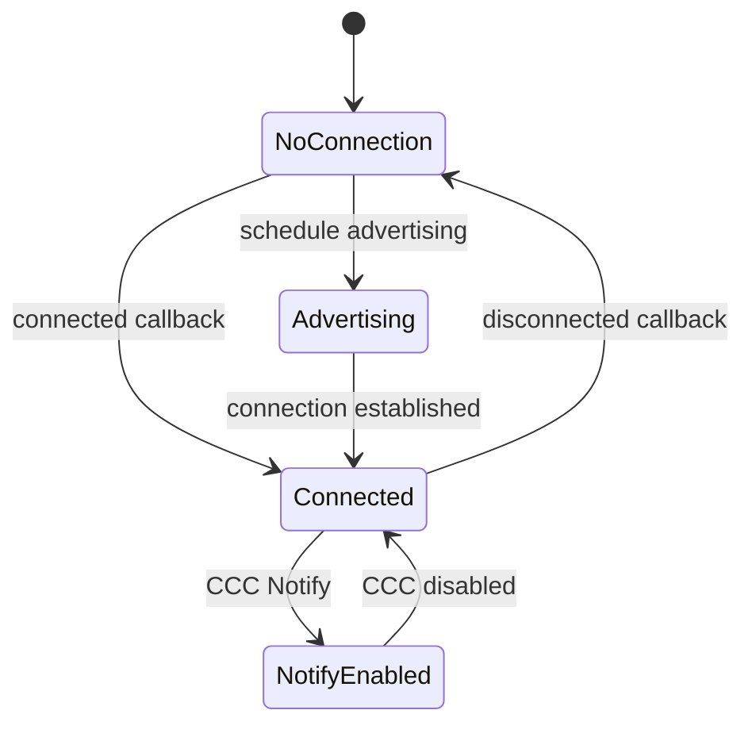
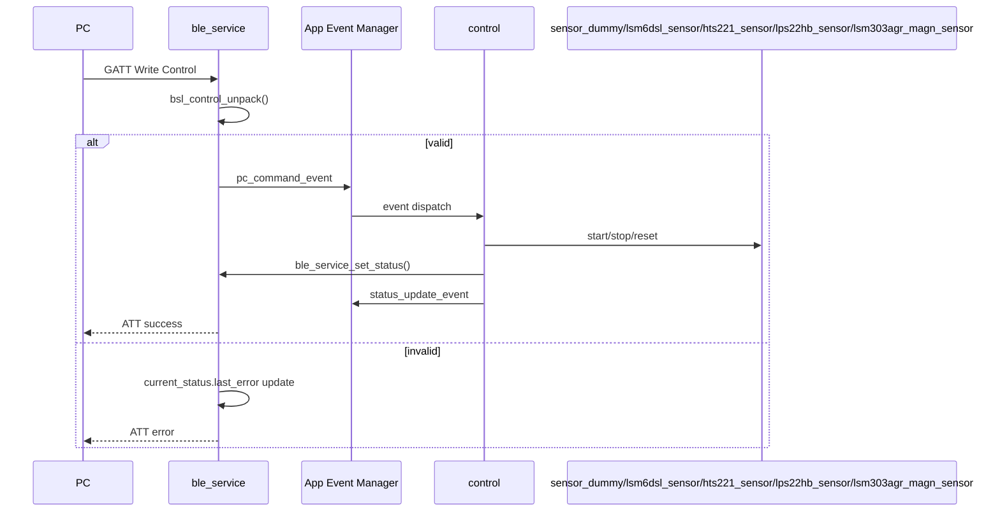

# Firmware設計書

作成日: 2026-06-17  
対象: `firmware/` 現行実装

## 1. 目的

本資料は、BLE Sensor Logger Firmwareの内部構成、module責務、event、状態遷移、BLE連携を定義する。全体interfaceは `system_design.md`、外部仕様は `../specs/current_implementation_spec.md` を参照する。

## 2. 前提

| 項目 | 内容 |
| --- | --- |
| Target | nRF52840 DK |
| Board target | `nrf52840dk/nrf52840` |
| SDK | NCS v3.2.2 |
| RTOS | Zephyr |
| BLE role | Peripheral / GATT Server |
| Event framework | App Event Manager |
| Sensor | dummy accel、X-NUCLEO-IKS01A2上のLSM6DSL / HTS221 / LPS22HB / LSM303AGR magnetometer |
| 実センサ拡張候補 | X-NUCLEO-IKS01A2上のLSM303AGR accel |

移植性ルール:

- nRF52840 DK固有helper APIをapplication logicで使わない。
- NCS sample board-control helperへ依存しない。
- board固有pinはapplication logicへhardcodeせず、Devicetree overlayへ分離する。
- 実センサはZephyr sensor APIを優先し、必要に応じて薄いdriver adapterを作る。
- hardware依存はDevicetree/Kconfigまたは薄いplatform adapterへ寄せる。

X-NUCLEO-IKS01A2向けの実装順序:

1. LSM6DSL 26 Hz 6軸(accel + gyro) streamを最初に実装する。
2. HTS221 humidity/temperature 1 Hz streamを低頻度環境streamとして追加する。
3. LPS22HB pressure 1 Hz streamを低頻度環境streamとして追加する。
4. LSM303AGR magnetometer 10 Hz streamを追加する。
5. 必要に応じてLSM303AGR accelを追加する。2026-06-20のdebug probeでZephyr `st,lis2dh` driver経由のready/sample取得は確認済みだが、LSM6DSL accelと重複するため後回しにする。

## 3. Module構成

```text
firmware/src/
  main.c
  protocol/
    protocol.h
    protocol.c
  modules/
    ble_service.h
    ble_service.c
    control.h
    control.c
    sensor_dummy.h
    sensor_dummy.c
    lsm6dsl_sensor.h
    lsm6dsl_sensor.c
    hts221_sensor.h
    hts221_sensor.c
    lps22hb_sensor.h
    lps22hb_sensor.c
    lsm303agr_magn_sensor.h
    lsm303agr_magn_sensor.c
  events/
    ble_events.h/.c
    config_events.h/.c
    sensor_events.h/.c
    status_events.h/.c
  platform/
    platform_time.h
    platform_time.c
```

| Module | 責務 | 外部依存 |
| --- | --- | --- |
| `main` | 初期化順序の制御 | Zephyr init/log |
| `protocol` | Protocol v3のC struct、pack/unpack、validation | 標準C |
| `ble_service` | BLE enable、Advertising、GATT Service、Characteristic callback、Notify | Zephyr Bluetooth、App Event Manager |
| `control` | PC command/config/BLE/sensor eventを処理し、状態とsensor動作を制御 | App Event Manager、各module |
| `sensor_dummy` | dummy accel3 sample生成、sequence管理、interval反映 | Zephyr workqueue |
| `lsm6dsl_sensor` | X-NUCLEO-IKS01A2のLSM6DSL 6軸sample取得、sequence管理、availability判定 | Zephyr sensor API、Devicetree shield |
| `hts221_sensor` | X-NUCLEO-IKS01A2のHTS221 humidity/temperature sample取得、sequence管理、availability判定 | Zephyr sensor API、Devicetree shield |
| `lps22hb_sensor` | X-NUCLEO-IKS01A2のLPS22HB pressure sample取得、sequence管理、availability判定 | Zephyr sensor API、Devicetree shield |
| `lsm303agr_magn_sensor` | X-NUCLEO-IKS01A2のLSM303AGR magnetometer sample取得、sequence管理、availability判定 | Zephyr sensor API、Devicetree shield |
| `platform_time` | uptime取得の薄いadapter | Zephyr time |
| `events/*` | App Event Manager event型定義とlog | App Event Manager |

## 4. Firmware architecture



## 5. 初期化

`main.c` は以下を初期化する。

1. App Event Manager
2. dummy sensor
3. LSM6DSL sensor
4. HTS221 sensor
5. LPS22HB sensor
6. LSM303AGR magnetometer sensor
7. control
8. BLE service

LSM6DSL/HTS221/LPS22HB/LSM303AGR magnetometer初期化失敗はFirmware全体の起動失敗にはしない。BLE service初期化時に各sensorのavailabilityを見てCapabilityのstream数を決める。`bt_enable()` 後にAdvertisingを開始する。

## 6. Event設計

| Event | Producer | Consumer | Payload | 用途 |
| --- | --- | --- | --- | --- |
| `pc_command_event` | `ble_service` | `control` | `struct bsl_control` | Control Writeを非同期処理へ渡す |
| `config_update_event` | `ble_service` | `control` | `struct bsl_config` | Config Writeを反映する |
| `ble_connected_event` | `ble_service` | `control` | なし | 接続状態反映 |
| `ble_disconnected_event` | `ble_service` | `control` | reason | 切断時のsampling停止 |
| `sensor_sample_event` | `sensor_dummy` / `lsm6dsl_sensor` / `hts221_sensor` / `lps22hb_sensor` / `lsm303agr_magn_sensor` | `control` | `struct bsl_sensor_data` | Sensor Data Notify |
| `status_update_event` | `control` | log/event monitor | `struct bsl_status` | 状態更新の観測 |

設計意図:

- BLE callback内で直接measurement制御を行わず、event経由で `control` に集約する。
- Sensor sampleもeventとして扱い、送信処理を `control` 経由で `ble_service` に渡す。

## 7. 状態管理

### 7.1 Device state

`control.c` が `struct bsl_status` を保持する。

| State | 意味 |
| --- | --- |
| `IDLE` | sampling停止中 |
| `MEASURING` | dummy accel3、readyな場合はLSM6DSL / HTS221 / LPS22HB / LSM303AGR magnetometer sampling実行中 |
| `ERROR` | enumとして定義済み。現行通常経路では主に`last_error`で異常を表す |



### 7.2 BLE connection state

`ble_service.c` が `current_conn` と `notify_enabled` を保持する。



## 8. Control処理



Commandごとの処理:

| Command | 処理 |
| --- | --- |
| `START_MEASUREMENT` | `status.state=MEASURING`, sensor別error fieldと代表 `last_error` にoptional sensor診断を反映、`lsm6dsl_sensor_start()`, `hts221_sensor_start()`, `lps22hb_sensor_start()`, `lsm303agr_magn_sensor_start()`, `sensor_dummy_start()` |
| `STOP_MEASUREMENT` | `status.state=IDLE`, sensor別error fieldと代表 `last_error` にoptional sensor診断を反映、`lsm6dsl_sensor_stop()`, `hts221_sensor_stop()`, `lps22hb_sensor_stop()`, `lsm303agr_magn_sensor_stop()`, `sensor_dummy_stop()` |
| `REQUEST_STATUS` | 状態変更せず `publish_status()` |
| `RESET_SEQUENCE` | `lsm6dsl_sensor_reset_sequence()`, `hts221_sensor_reset_sequence()`, `lps22hb_sensor_reset_sequence()`, `lsm303agr_magn_sensor_reset_sequence()`, `sensor_dummy_reset_sequence()` |

## 9. Config処理

現行Config v4 Writeは `ble_service` のcallbackでpayload長、version、op、stream_id、flags、interval範囲、reservedを検証する。検証成功後、`config_update_event` を発行する。

`control` は `config_update_event` を受けると以下を行う。

- `status.sample_interval_ms` を更新する。
- sensor別error fieldと代表 `last_error` にoptional sensor診断を反映する。
- `sensor_dummy_set_interval()` を呼ぶ。
- `ble_service_set_config()` を呼ぶ。
- `status_update_event` を発行する。

現行v4の最小実装では、`op=SET_STREAM_INTERVAL` と `stream_id=1` のみvalidとし、base/mixed streamのdummy sensor intervalを変更する。`SET_STREAM_ENABLE`、実センサstreamのrate変更、TLV化、Config Request/Responseはv4の実機確認後に再検討する。

## 10. Sensor処理

### 10.1 dummy sensor

`sensor_dummy` はdelayable workでsampleを生成する。

- interval初期値は100 ms。
- `START_MEASUREMENT` で即時sample workをscheduleする。
- `STOP_MEASUREMENT` でworkをcancelする。
- sequenceは `uint16` でincrementし、wrap可能。
- accel値はsequence由来の疑似波形。
- payloadは `DUMMY_ACCEL3_INT16_V1`、accel x/y/zをmgのint16で送信する。

### 10.2 LSM6DSL sensor

`lsm6dsl_sensor` はX-NUCLEO-IKS01A2のLSM6DSLをZephyr sensor APIで扱う。

- build時はZephyr標準shield `x_nucleo_iks01a2` を指定する。
- 起動時に `DEVICE_DT_GET_ONE(st_lsm6dsl)` と `device_is_ready()`、26 Hz ODR設定を確認する。
- 初期化できた場合のみ `ready=true` とし、Capabilityに `stream_id=10` の `IMU6` streamを含める。
- `START_MEASUREMENT` で約38 ms周期のdelayable workを開始する。
- payloadは `IMU6_INT16_V1`、accel x/y/zをmg、gyro x/y/zをmdpsのint16で送信する。
- 初期化失敗時もFirmwareはBLE Advertisingを継続し、`DUMMY_ACCEL3` streamだけを提供する。
- `lsm6dsl_sensor_status_error()` はoptional streamのavailability診断を返す。`NO_DEVICETREE`、`NOT_READY`、`CONFIG_FAILED` の3種類をStatus `last_error` へ反映できる。

### 10.3 HTS221 sensor

`hts221_sensor` はX-NUCLEO-IKS01A2のHTS221をZephyr sensor APIで扱う。

- `DEVICE_DT_GET_ONE(st_hts221)` を使う。
- `device_is_ready()` でavailabilityを判定する。
- 初期化できた場合のみ `ready=true` とし、Capabilityに `stream_id=30` の `TEMP_HUMIDITY` streamを含める。
- 1秒周期のdelayable workで `SENSOR_CHAN_HUMIDITY` と `SENSOR_CHAN_AMBIENT_TEMP` を取得する。
- payloadは `HTS221_TEMP_HUMIDITY_INT16_V1`、humidityを0.01 %RH、temperatureを0.01 degCのint16で送信する。
- 初期化失敗時もFirmwareはBLE Advertisingを継続し、readyな他streamだけを提供する。
- `hts221_sensor_status_error()` は `NO_DEVICETREE` または `NOT_READY` をStatus `last_error` へ反映できる。

### 10.4 LPS22HB sensor

`lps22hb_sensor` はX-NUCLEO-IKS01A2のLPS22HBをZephyr sensor APIで扱う。

- `DEVICE_DT_GET_ONE(st_lps22hb_press)` を使う。
- `device_is_ready()` でavailabilityを判定する。
- 初期化できた場合のみ `ready=true` とし、Capabilityに `stream_id=20` の `PRESSURE` streamを含める。
- 1秒周期のdelayable workで `SENSOR_CHAN_PRESS` を取得する。
- payloadは `LPS22HB_PRESSURE_INT32_V1`、pressureをPa単位のint32で送信する。
- 初期化失敗時もFirmwareはBLE Advertisingを継続し、readyな他streamだけを提供する。
- `lps22hb_sensor_status_error()` は `NO_DEVICETREE` または `NOT_READY` をStatus `last_error` へ反映できる。

### 10.5 LSM303AGR magnetometer sensor

`lsm303agr_magn_sensor` はX-NUCLEO-IKS01A2のLSM303AGR magnetometerをZephyr `st,lis2mdl` driver互換のsensor APIで扱う。

- X-NUCLEO-IKS01A2 shield overlay上の `magn0` は `st,lis2mdl` 互換として扱う。
- LSM303AGR magnetometerは `0x1e`、WHO_AM_I registerは `0x4f`、期待値は `0x40`。
- `DEVICE_DT_GET(DT_ALIAS(magn0))` と `SENSOR_CHAN_MAGN_XYZ` を使う。
- 初期化できた場合のみ `ready=true` とし、Capabilityに `stream_id=12` の `MAG3` streamを含める。
- 100 ms周期のdelayable workで `SENSOR_CHAN_MAGN_XYZ` を取得する。
- payloadは `MAG3_INT16_V1`、mag x/y/zをuT単位のint16で送信する。Zephyr LIS2MDL driverのmicro-gauss相当値を `uT = micro_gauss / 10000` として変換する。
- 初期化失敗時もFirmwareはBLE Advertisingを継続し、readyな他streamだけを提供する。
- `lsm303agr_magn_sensor_status_error()` は `NO_DEVICETREE` または `NOT_READY` をStatus `last_error` へ反映できる。

### 10.6 LSM303AGR accel候補

LSM303AGR accelはまだ通常runtime streamとしては未実装である。2026-06-20のdebug build限定probeでは、以下を確認済み。

- X-NUCLEO-IKS01A2 shield overlay上の `accel0` は `st,lis2dh` 互換として扱う。
- LSM303AGR accelは `0x19`、WHO_AM_I registerは `0x0f`、期待値は `0x33`。
- `DEVICE_DT_GET(DT_ALIAS(accel0))` と `SENSOR_CHAN_ACCEL_XYZ` でready/sample取得ができる。

LSM303AGR accel `stream_id=11` はLSM6DSL accelと用途が重なるため、比較用途や低電力構成などの理由が明確になってから追加する。この判断理由は `docs/adr/0006-defer-lsm303agr-accel-stream.md` を正とする。

## 11. BLE service設計

`ble_service` は以下を担当する。

- UUID定義
- GATT Service登録
- Config Read/Write
- Control Write
- Status Read
- Sensor Data Notify
- Advertising開始/再開
- BLE connected/disconnected callback
- Sensor Data CCC状態管理

GATT構成:

| Characteristic | Properties | callback |
| --- | --- | --- |
| Sensor Data | Notify | CCC changed、notify送信 |
| Control | Write / Write Without Response | `write_control` |
| Config | Read / Write | `read_config`, `write_config` |
| Status | Read | `read_status` |
| Capability | Read | `read_capability` |

Capabilityは起動時の実センサavailabilityを反映する。`DUMMY_ACCEL3` は常時含め、LSM6DSLがreadyな場合は `stream_id=10`、HTS221がreadyな場合は `stream_id=30`、LPS22HBがreadyな場合は `stream_id=20`、LSM303AGR magnetometerがreadyな場合は `stream_id=12` を追加する。現行の最大stream数は5である。Firmware Capability schema v1はstream descriptorまでを扱い、field単位のlabel/unit/scale metadataはPC backendが `payload_format` から補完する。Firmware payloadへfield descriptorを入れる場合はschema v2またはTLV化として別途設計する。optional sensorがreadyでない場合、Statusは `lsm6dsl_error`、`hts221_error`、`lps22hb_error`、`lsm303agr_magn_error` にsensor別診断値を入れ、`last_error` には代表値を入れる。

## 12. Error handling

| 発生箇所 | 処理 |
| --- | --- |
| Control offset不正 | `BT_ATT_ERR_INVALID_OFFSET` |
| Control長不正 | `last_error=INVALID_LENGTH`, `BT_ATT_ERR_INVALID_ATTRIBUTE_LEN` |
| Control version不正 | `last_error=INVALID_VERSION`, `BT_ATT_ERR_VALUE_NOT_ALLOWED` |
| Control command不正 | `last_error=INVALID_COMMAND`, `BT_ATT_ERR_VALUE_NOT_ALLOWED` |
| Config不正 | `last_error=INVALID_CONFIG`, `BT_ATT_ERR_VALUE_NOT_ALLOWED` |
| Notify時未接続 | `last_error=NOT_CONNECTED`, `-ENOTCONN` |
| Notify時未購読 | `last_error=NOT_SUBSCRIBED`, `-EACCES` |
| LSM6DSL devicetree nodeなし | `lsm6dsl_error=LSM6DSL_NO_DEVICETREE`、Firmware起動継続、LSM6DSL streamはCapabilityから除外 |
| LSM6DSL device未ready | `lsm6dsl_error=LSM6DSL_NOT_READY`、Firmware起動継続、LSM6DSL streamはCapabilityから除外 |
| LSM6DSL ODR設定失敗 | `lsm6dsl_error=LSM6DSL_CONFIG_FAILED`、Firmware起動継続、LSM6DSL streamはCapabilityから除外 |
| HTS221 devicetree nodeなし | `hts221_error=HTS221_NO_DEVICETREE`、Firmware起動継続、HTS221 streamはCapabilityから除外 |
| HTS221 device未ready | `hts221_error=HTS221_NOT_READY`、Firmware起動継続、HTS221 streamはCapabilityから除外 |
| LPS22HB devicetree nodeなし | `lps22hb_error=LPS22HB_NO_DEVICETREE`、Firmware起動継続、LPS22HB streamはCapabilityから除外 |
| LPS22HB device未ready | `lps22hb_error=LPS22HB_NOT_READY`、Firmware起動継続、LPS22HB streamはCapabilityから除外 |
| LSM303AGR magnetometer devicetree aliasなし | `lsm303agr_magn_error=LSM303AGR_MAGN_NO_DEVICETREE`、Firmware起動継続、MAG3 streamはCapabilityから除外 |
| LSM303AGR magnetometer device未readyまたは設定失敗 | `lsm303agr_magn_error=LSM303AGR_MAGN_NOT_READY`、Firmware起動継続、MAG3 streamはCapabilityから除外 |

## 13. 既知の設計課題

| 課題 | 対応方針 |
| --- | --- |
| Capabilityが最小schemaのみ | 複数stream、field単位metadata、payload format管理へ拡張する |
| Status Notify未実装 | start/stop/config/error push用に追加検討 |
| `connection_count`の責務が分散 | BLE層とcontrol層のどちらを正にするか整理する |
| Config v4の対象streamが限定的 | 現行は `stream_id=1` のinterval変更まで。enable/disableや実センサrate変更は次段で設計する |
| 実センサready失敗時の詳細診断不足 | sensor別の最小診断はStatusに追加済み。I2C scanやaddress候補など詳細はLog/Eventで追加検討 |
| ADC/board analog stream | 旧mixed payloadからA0 ADCは外した。必要になった時点で独立streamとして復活させる |
