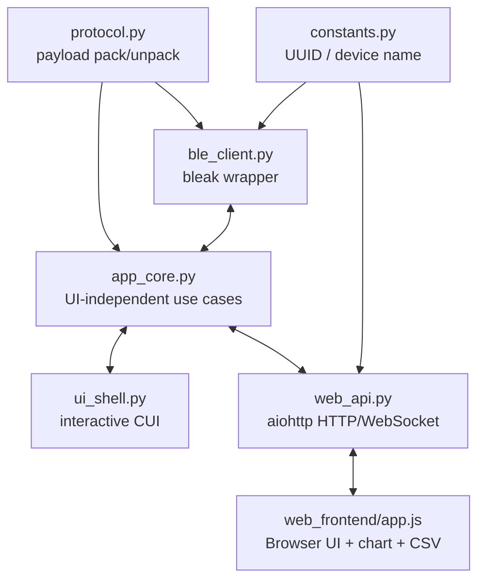
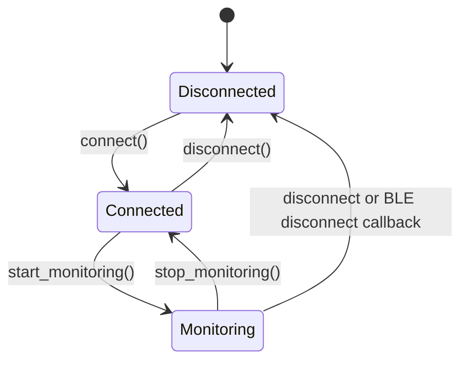
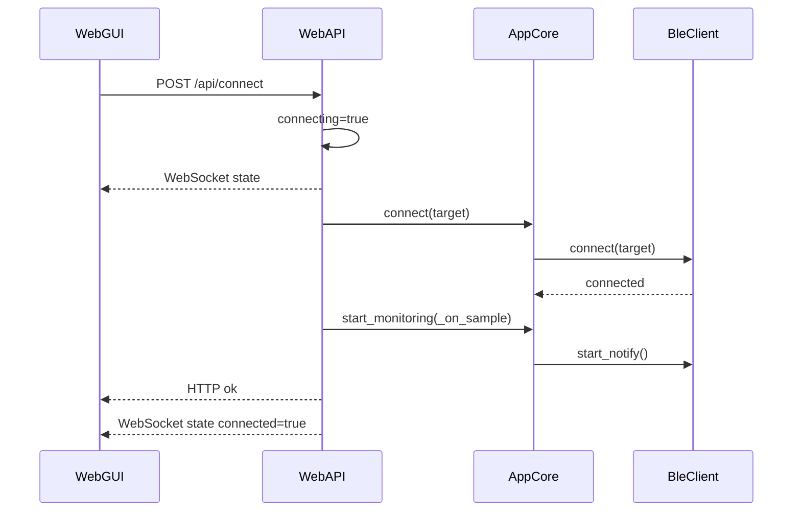
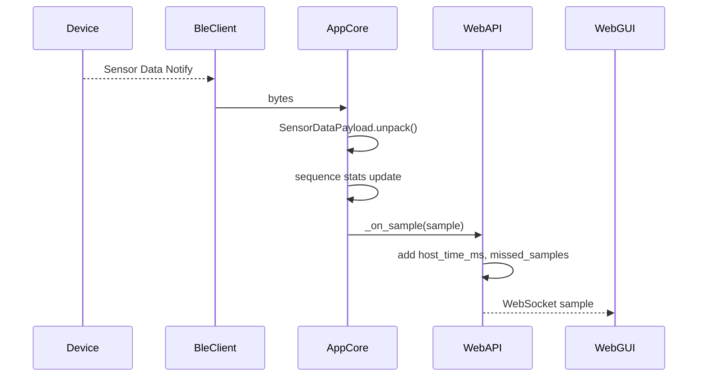
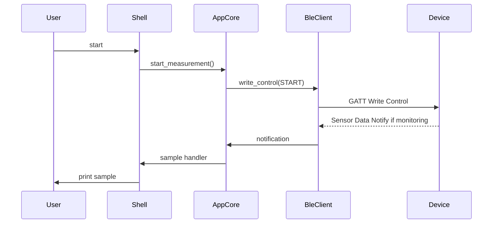

# PC backend / WebApp設計書

作成日: 2026-06-17  
対象: `pc_app/` 現行実装

## 1. 目的

本資料は、Python backend、interactive CUI、local WebGUIの内部構成、状態管理、HTTP/WebSocket API、CSV loggingを定義する。BLE/GATT payloadの詳細は `../specs/current_implementation_spec.md`、全体構成は `system_design.md` を参照する。

## 2. 構成

```text
pc_app/
  pyproject.toml
  uv.lock
  src/ble_sensor_logger/
    __main__.py
    constants.py
    protocol.py
    ble_client.py
    app_core.py
    ui_shell.py
    web_api.py
  web_frontend/
    index.html
    styles.css
    app.js
  tests/
    test_protocol.py
    test_app_core.py
    test_web_api.py
  scripts/
    ble_e2e_smoke.py
    ble_negative_smoke.py
```

## 3. Architecture



設計原則:

- BLE処理は `ble_client.py` に閉じ込める。
- Protocol parse/packは `protocol.py` に閉じ込める。
- CUIとWebGUIは `app_core.py` の公開APIを共有する。
- BrowserはWeb Bluetooth APIを使わない。
- WebGUIは表示、操作、chart、CSV downloadを担当し、BLE状態の正本はbackendに置く。

## 4. Module責務

| Module | 責務 |
| --- | --- |
| `constants.py` | Device name、Service/Characteristic UUID、scan timeout |
| `protocol.py` | Protocol v3 Sensor Data frame parse、MIXED/IMU6/HTS221/LPS22HB/MAG3 stream-specific payload parse、Control/Config/Status/Capability pack/unpack、enum定義、validation |
| `ble_client.py` | bleak import、scan、connect、disconnect、start/stop notify、GATT write/read |
| `app_core.py` | UI非依存use case、接続状態、monitoring状態、stream単位のsequence欠落検出 |
| `ui_shell.py` | terminal commandを`app_core`へ変換し、結果を表示 |
| `web_api.py` | aiohttp app、HTTP API、WebSocket broadcast、connect task cancel、static file配信 |
| `web_frontend/app.js` | WebGUI操作、WebSocket受信、chart描画、CSV生成 |

## 5. AppCore状態

`SensorLoggerApp` は `AppState` を保持する。

| Field | 型 | 意味 |
| --- | --- | --- |
| `connected` | bool | BLE接続済み |
| `monitoring` | bool | Sensor Data Notification購読中 |
| `last_sequence` | int / None | 後方互換用に保持する最後の受信sequence |
| `last_sequences_by_stream` | dict[int, int] | streamごとに最後に受信したsequence |
| `missed_samples` | int | sequence欠落数 |



Sequence欠落検出:

- streamごとの初回sampleでは欠落判定しない。
- 2回目以降は同じstreamの前回値から `expected = (last_sequence + 1) & 0xFFFF` とする。
- 受信sequenceがexpectedと異なる場合、`(sequence - expected) & 0xFFFF` を `missed_samples` に加算する。
- `reset_sequence()` 実行時は `last_sequence=None`, `last_sequences_by_stream={}`, `missed_samples=0` に戻す。

## 6. BLE client設計

`BleSensorClient` はbleakを遅延importする。UI層はbleakへ直接依存しない。

主要API:

| Method | 内容 |
| --- | --- |
| `scan()` | Service UUIDを指定してscanし、Device nameまたはUUID一致でfilter |
| `connect(name_or_address)` | nameまたはaddressで接続 |
| `disconnect()` | 接続を閉じる |
| `start_notifications(handler)` | Sensor Data notify購読 |
| `stop_notifications()` | Sensor Data notify停止 |
| `write_control(payload)` | Control CharacteristicへWrite With Response |
| `write_config(payload)` | Config CharacteristicへWrite With Response |
| `read_status()` | Status CharacteristicをRead |
| `read_config()` | Config CharacteristicをRead |
| `read_capability()` | Capability CharacteristicをRead |

AppCoreは `set_stream_interval(stream_id, interval_ms)` でConfig v4 payloadをpackし、`op=SET_STREAM_INTERVAL` と対象streamを明示してWriteする。既存の `set_interval(interval_ms)` は `stream_id=1` 向けの互換的な便利メソッドとして残す。Orientation filter設定は `set_orientation_filter_params(complementary_alpha, mahony_kp, mahony_ki)` で、Config v4の `SET_COMPLEMENTARY_ALPHA`、`SET_MAHONY_KP`、`SET_MAHONY_KI` を順にWriteする。

エラー方針:

- 未接続操作は `BleClientError("not connected")`。
- bleak未install時は `BleClientError`。
- connect失敗時は可能ならdisconnectし、client状態をクリアする。

## 7. HTTP API設計

HTTP APIの外部仕様は `../specs/current_implementation_spec.md` を正とする。

実装上の方針:

- `WebBackend` が `SensorLoggerApp` を保持する。
- 接続中は `connecting=True` とし、WebSocketでstateをbroadcastする。
- 同時に複数の接続taskは許可せず、既存taskがある場合はHTTP 409を返す。
- 接続成功後、WebGUI用に自動で `start_monitoring()` を実行する。
- `/api/capability` は接続中のみCapabilityをReadし、stream metadataをJSONへ整形して返す。現行では `DUMMY_ACCEL3`、`IMU6`、`ORIENTATION_MOTION`、`TEMP_HUMIDITY`、`PRESSURE`、`MAG3` を扱える。`ORIENTATION_MOTION` / `ORIENTATION_MOTION_INT16_V1` は角度と合成加速度のfield metadataをbackendで補完する。
- WebGUIで使うfield label、unit、scale、decimal表現は、Firmware Capability schema v1には含めず、backendが `payload_format` から補完した `fields` metadataとして `/api/capability` へ付与する。このbackend補完を現行仕様とし、Firmware由来のfield descriptorが必要になった場合はCapability schema v2またはTLV化として扱う。
- shutdown時は接続task cancel、BLE disconnect、WebSocket closeを行う。



## 8. WebSocket設計

`/ws` 接続時:

1. WebSocketをprepareする。
2. `websockets` setへ追加する。
3. 現在のstate messageを送信する。
4. `latest_sample` があればsample messageを送信する。

Broadcast:

- `state` は接続状態変更、操作後、切断callbackで送る。
- `sample` はSensor Data受信ごとに送る。
- 送信失敗したWebSocketはstaleとしてsetから削除する。



## 9. WebGUI設計

WebGUIはstatic HTML/CSS/JSで構成される。backendと同一originで配信される。

主要状態:

| 変数 | 意味 |
| --- | --- |
| `connected` | backend stateの接続状態 |
| `connecting` | connect task進行中 |
| `history` | chart用sample履歴。最大5000点 |
| `fieldDefinitions` | `/api/capability` のstream/field metadataから作る表示field一覧 |
| `metricDefinitions` | `stream_id + field` をkeyにしたChart/最新値カード用Signal定義 |
| `graphConfigs` | 最大3グラフ分の表示有効/無効、最大3系列、Y軸range、X軸range設定 |
| `orientationState` | stream_id=13の最新姿勢sampleとThree.js 3D cuboid描画状態 |
| `csvRecording` | CSV記録中 |
| `csvSamples` | CSV保存対象sample |

UI操作:

| 操作 | Backend API |
| --- | --- |
| Scan | `GET /api/scan` |
| Connect | `POST /api/connect` |
| Cancel connection | `POST /api/connect/cancel` |
| Disconnect | `POST /api/disconnect` |
| Start | `POST /api/start` |
| Stop | `POST /api/stop` |
| Reset sequence | `POST /api/reset-sequence` |
| Apply stream interval | `POST /api/interval` |
| Apply orientation filters | `POST /api/orientation-filter` |
| Refresh status | `GET /api/status` |
| Read capability | `GET /api/capability` |

Chart:

- 最大3個のCanvas graph panelへ描画する。Graph 1は初期有効、Graph 2/3は任意に有効化する。
- 各graphは最大3つのSignalを表示できる。各Signal select optionは `/api/capability` の `streams[].fields[]` から生成する。
- GraphごとのSignal/Y軸/X軸controlは折りたたみ可能なControls領域に置く。3 graphを横並びにしたときは、viewport幅ではなくgraph panel幅に応じてSignal selectやrange controlを縦積みにし、control同士が重ならないことを優先する。
- 最新値カードも `/api/capability` の `streams[].fields[]` から生成し、stream追加時にHTMLへ固定カードを足さない。
- Interval controlのstream選択肢は `/api/capability` のstream metadataから生成する。現行WebGUIでは `min_interval_ms` と `max_interval_ms` が異なるstreamを設定可能候補として表示し、Config v4 Write時は `stream_id` と `interval_ms` をbackendへ送る。
- X軸はhost timeをhh:mm:ssで表示する。Autoでは保持履歴内の選択Signal sample全体を表示し、Secondsでは最新sampleから指定秒数分のwindowを表示する。
- Y軸は選択Signalのmin/maxから自動scaleするか、graphごとにmanual min/maxを指定する。Chart描画値はCapability由来の `scale` を適用した表示単位の値とする。
- 履歴は最大5000点。
- WebSocket sampleでは、payload formatに存在しないfieldを `null` として扱う。Chartは `null` を点列から除外し、最新値カードは対象fieldを持つsampleを受け取ったときだけ更新する。これにより、複数stream混在時に未定義fieldの0が別signalへ混入することを防ぐ。
- `accel_x_mg` / `accel_y_mg` / `accel_z_mg` のように複数streamが同じfield名を持つ場合は、Signal定義に `stream_id` も含める。現行WebGUIでは `s1_accel_z_mg` と `s10_accel_z_mg` のように `stream_id + field` をkeyにし、`Dummy Accel Z` と `LSM6DSL Accel Z` を別Signalとして扱い、同じchart系列へ混ぜない。

Orientation view:

- `stream_id=13` / `ORIENTATION_MOTION` のfield metadataがある場合、WebGUIはThree.jsで3D cuboidを表示する。
- 3D cuboidはNaive、相補フィルタ、Mahony filterの3方式を同時に表示できる。各方式はtoggleで表示/非表示を切り替えられる。
- Readoutは各方式のPitch/Roll/Zenith/Accel normを表示し、MahonyはYawも表示する。
- 3D描画はruntimeで外部CDNへ依存せず、`pc_app/web_frontend/vendor/three.module.min.js` をlocal static assetとして配信する。
- 最新姿勢readoutは `pitch`、`roll`、`zenith`、`accel_norm_mg` を表示する。`zenith` は姿勢の補助表示であり、cuboid rotationはpitch/rollで行う。

## 10. CSV設計

CSVはBrowser側で生成し、downloadする。backend側の永続保存は行わない。

記録開始:

- `csvSamples=[]`
- `csvRecording=true`
- ボタン表示を `Stop & save CSV` にする。

記録中:

- WebSocket sampleを受けるたびに `csvSamples` へ追加する。
- 直前historyと `stream_id`、`sequence`、`timestamp_ms`、`payload_format` が同一の場合だけ重複sampleとしてchart更新とCSV追加を避ける。同じ `host_time_ms` に複数streamのsampleが届く場合は、別sampleとして記録する。

保存:

- UTF-8 BOM付きCSVを生成する。
- 改行はCRLF。
- file名は `ble_sensor_log_<ISO timestamp>.csv`。
- 複数streamは1つのwide CSVにまとめる。stream別CSV分割は現時点では行わない。
- 値列は `s<stream_id>_<field>` のstream-qualified列名にする。例: `s1_accel_z_mg`, `s10_accel_z_mg`。
- sample行と一致しないstreamの値列は空欄にする。

CSV fields:

```text
host_time_iso,host_time_ms,version,message_type,stream_id,flags,sequence,
timestamp_ms,payload_format,payload_len,<stream-qualified Capability fields...>,
missed_samples
```

`<stream-qualified Capability fields...>` は `/api/capability` の `streams[].fields[]` をstream順に展開した列である。現行のfallback/defaultでは `s1_accel_x_mg`、`s1_accel_y_mg`、`s1_accel_z_mg`、`s10_accel_x_mg`、`s10_accel_y_mg`、`s10_accel_z_mg`、`s10_gyro_x_mdps`、`s10_gyro_y_mdps`、`s10_gyro_z_mdps`、`s30_humidity_centi_percent`、`s30_temperature_centi_c`、`s20_pressure_pa`、`s12_mag_x_ut`、`s12_mag_y_ut`、`s12_mag_z_ut` を含む。

## 11. interactive CUI設計

CUIはterminal commandを `SensorLoggerApp` のmethodへ変換する薄いUIである。
`capability` commandは `read_capability()` を呼び、schema/feature/stream概要を表示する。`monitor` ではpayload formatに応じて、DUMMY_ACCEL3 sample、IMU6 sample、HTS221 humidity/temperature sample、LPS22HB pressure sample、LSM303AGR magnetometer sampleを表示する。



## 12. Test設計

現行のPC自動テスト:

| Test | 確認内容 |
| --- | --- |
| `test_protocol.py` | payload size、pack/unpack、validation、v3 Sensor Data frame parse、IMU6/HTS221/LPS22HB/MAG3/ORIENTATION_MOTION payload parse |
| `test_app_core.py` | sample handler、stream単位のsequence欠落検出、ORIENTATION_MOTIONを含むmulti-stream処理 |
| `test_web_api.py` | 期待route、Capability metadata JSON、payload外fieldをWeb sample JSONで `null` にすること、ORIENTATION_MOTION field metadata |

実行:

```bash
cd pc_app
uv run --extra dev pytest
```

## 13. 既知の設計課題

| 課題 | 対応方針 |
| --- | --- |
| Firmware Capability schema v1にfield descriptorがない | 現行仕様ではbackendが `payload_format` からWebGUI/CSV用field metadataを補完する。真にdevice self-describingにする場合はCapability schema version 2またはTLV化でfield descriptorを追加する |
| Status Notify未使用 | WebSocket state更新をBLE Status Notify起点にする |
| CSVがBrowser memory上のみ | 長時間logging時はbackend保存またはstreaming downloadを検討 |
| `/api/status` が操作後poll前提 | Status NotifyまたはControl Responseでpush化する |
