# 全体設計書

作成日: 2026-06-17  
対象: BLE Sensor Logger 現行実装  
関連仕様: `../specs/current_implementation_spec.md`

## 1. 目的

本資料は、Firmware、Python backend、interactive CUI、local WebGUIを含むシステム全体の構成、architecture、interface、状態遷移、主要sequenceを定義する。

現行実装の外部仕様は `../specs/current_implementation_spec.md`、Generic Sensor Monitor化の将来方針は `../generic_sensor_monitor_design_handoff.md` を正とする。

## 2. システム構成

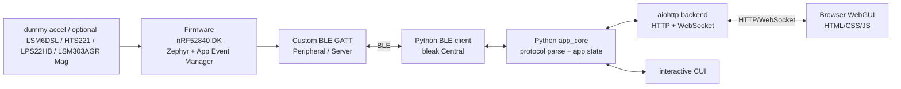

責務:

| 要素 | 責務 |
| --- | --- |
| Firmware | センサ取得、Protocol v4 frame生成、GATT Server、Control/Config処理、Status/Capability保持 |
| BLE GATT | DeviceとPC backendの境界。Sensor Data、Control、Config、Status、CapabilityをCharacteristicで分離 |
| Python BLE client | scan/connect/notify/write/readをbleakで実行 |
| app_core | UI非依存のuse case、Protocol parse、sequence欠落検出 |
| aiohttp backend | Browser向けHTTP/WebSocket API、接続task管理、sample配信 |
| interactive CUI | terminal操作UI |
| WebGUI | local browser上の操作・表示・chart・CSV download |

実センサ拡張では、X-NUCLEO-IKS01A2を代表ボード候補に加える。現行実装はLSM6DSLの26 Hz 6軸(accel + gyro) stream adapter、HTS221の1 Hz humidity/temperature stream adapter、LPS22HBの1 Hz pressure stream adapter、LSM303AGR magnetometerの10 Hz 3軸stream adapterを持つ。Firmware起動時に各sensorがreadyになった場合のみ、CapabilityとSensor Data Notifyに `stream_id=10`、`stream_id=30`、`stream_id=20`、`stream_id=12` を出す。

## 3. Architecture

### 3.1 レイヤ構成

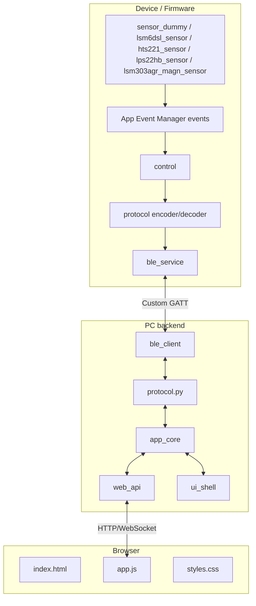

設計原則:

- BrowserはBLEを直接扱わない。
- CUIとWebGUIは同じ `app_core` を使う。
- BLE payload定義はFirmwareの `protocol.h/.c` とPythonの `protocol.py` で対応させる。
- FirmwareのBLE callbackはpayload validationとevent発行を行い、重い処理はcontrol側へ寄せる。
- 現行Protocol v4は固定長binaryであり、Sensor Dataは`stream_id`付きframeに`sample_count`を持つ。Capabilityは最小schemaとして実装済みである。試作段階のため旧Protocol v1/v2互換は持たない。

## 4. Interface仕様

### 4.1 BLE interface

BLE interfaceの詳細なpayload仕様は `../specs/current_implementation_spec.md` の「BLE仕様」と「Binary Protocol」を正とする。

概要:

| Interface | 方向 | Transport操作 | Payload |
| --- | --- | --- | --- |
| Sensor Data | Device -> PC | GATT Notify | `SensorDataPayload v4`, 17-125 bytes |
| Control | PC -> Device | GATT Write / Write Without Response | `ControlPayload`, 4 bytes |
| Config | PC <-> Device | GATT Read / Write | `ConfigPayload v4`, 8 bytes |
| Status | Device -> PC | GATT Read | `StatusPayload`, 16 bytes |

制約:

- byte orderはLittle Endian。
- 現行versionは4。
- Sensor DataはNotification購読後に配信される。
- Capabilityは起動時の実センサavailabilityを反映し、常時 `DUMMY_ACCEL3` を含む。LSM6DSLがreadyな場合は `stream_id=10` と `stream_id=13`、HTS221がreadyな場合は `stream_id=30`、LPS22HBがreadyな場合は `stream_id=20`、LSM303AGR magnetometerがreadyな場合は `stream_id=12` を追加し、現行の最大 `stream_count` は6である。
- Capability schema v1はFirmwareが返すstream descriptorまでを正とする。WebGUI/CSV向けのfield metadataはPC backendが `payload_format` から補完し、Firmware payloadへfield descriptorを入れる場合はschema v2またはTLV化として別途設計する。
- StatusはReadのみで、Notifyは未実装。optional sensor availabilityは `lsm6dsl_error`、`hts221_error`、`lps22hb_error`、`lsm303agr_magn_error` で同時に読める。
- 現行Config v4は同じCharacteristic UUIDのままstream単位Configへ拡張した最小実装である。`SET_STREAM_INTERVAL` は `stream_id=1` の `DUMMY_ACCEL3` に限定し、`stream_id=13` では `SET_COMPLEMENTARY_ALPHA`、`SET_MAHONY_KP`、`SET_MAHONY_KI`、`SET_IIR_CUTOFF_MILLIHZ` をorientation filter設定として扱う。
- Config Writeは値検証に失敗するとATT errorを返す。

### 4.2 PC backend HTTP interface

HTTP APIの詳細は `../specs/current_implementation_spec.md` の「PC backend HTTP API」を正とする。

主な設計:

- REST風のHTTP endpointで操作を受け付ける。
- `/ws` でstate/sampleをpush配信する。
- `/api/connect` は接続完了までawaitし、接続中は `connecting` stateをWebSocketで通知する。
- `/api/connect/cancel` は進行中の接続taskをcancelする。
- `/api/status` は接続中のみGATT Status Readを実行する。

### 4.3 WebSocket interface

WebSocket messageは2種類である。

| type | 用途 |
| --- | --- |
| `state` | 接続状態、接続中状態、monitoring状態、欠落数 |
| `sample` | 最新Sensor Dataとhost timestamp、欠落数 |

WebGUIはWebSocket切断時に再接続を試みる。

## 5. 状態遷移図

### 5.1 Device measurement状態

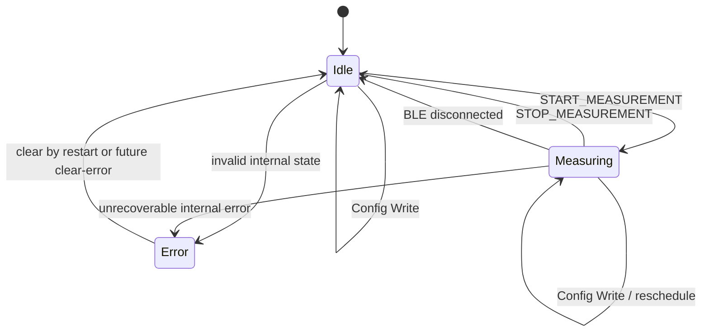

現行実装では `ERROR` stateはenumとして定義されているが、通常のinvalid Control/Configでは `last_error` を更新し、stateは主に `IDLE` / `MEASURING` を使う。

### 5.2 BLE接続状態

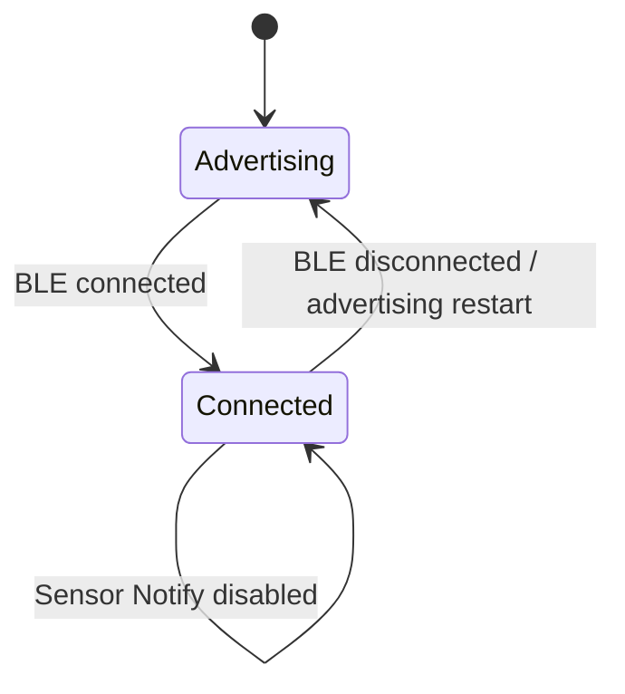

### 5.3 PC backend状態

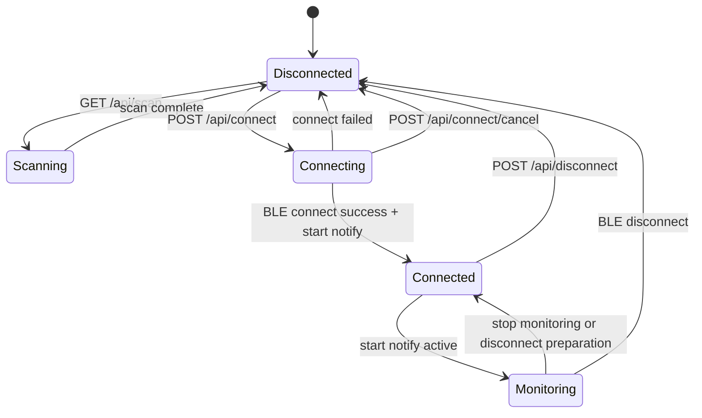

現行Web backendは接続成功後、自動的にSensor Data Notification購読を開始するため、WebGUI経由では `Connected` と `Monitoring` はほぼ同時に成立する。

### 5.4 WebGUI表示状態

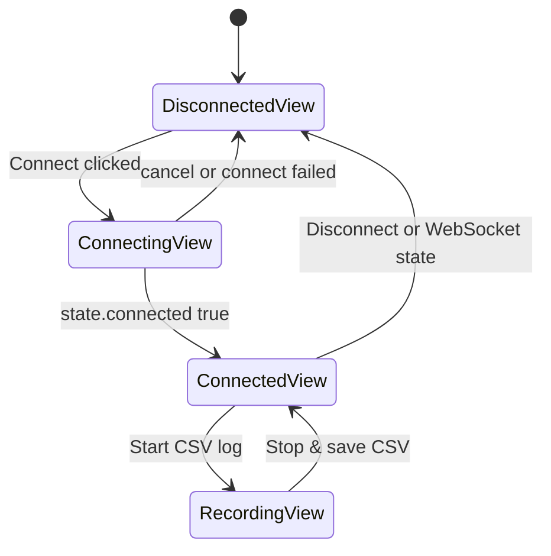

## 6. シーケンス図

### 6.1 Scanから接続まで

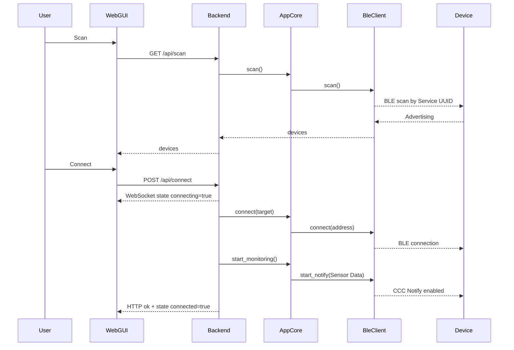

### 6.1.1 接続直後のCapability取得とmeasurement開始

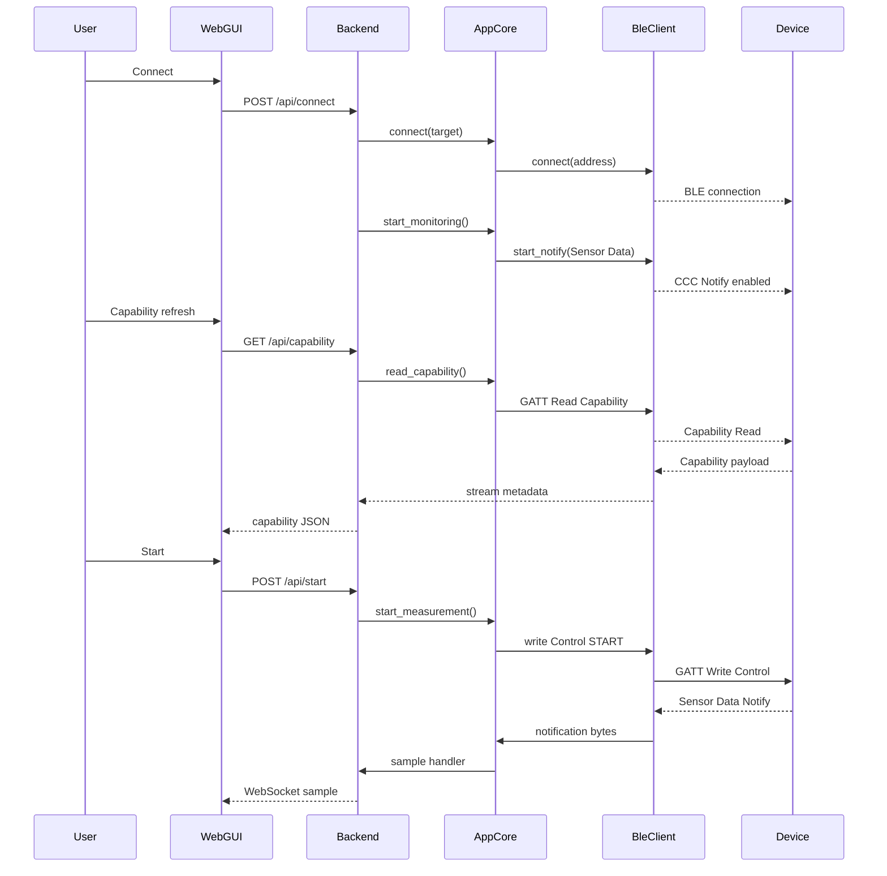

### 6.2 Measurement開始とsample配信

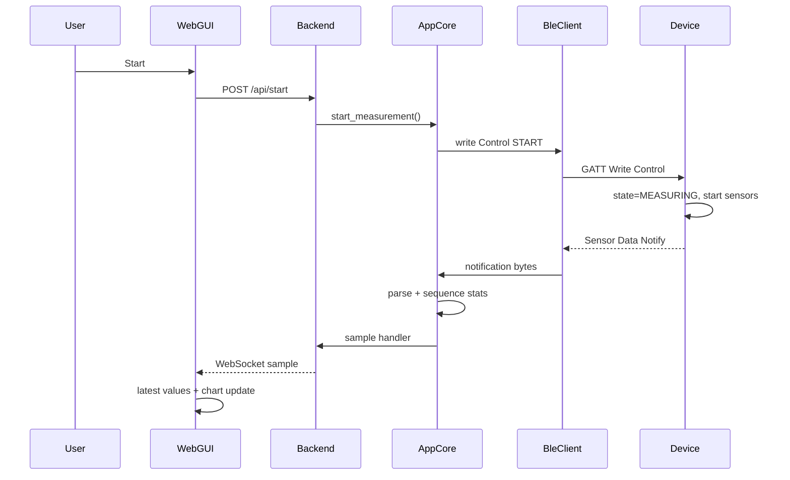

### 6.3 Config変更

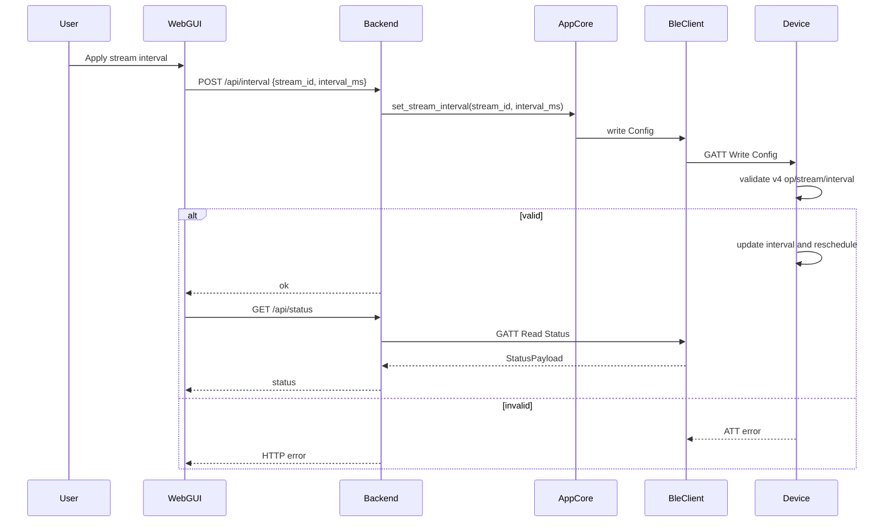

### 6.4 CSV記録

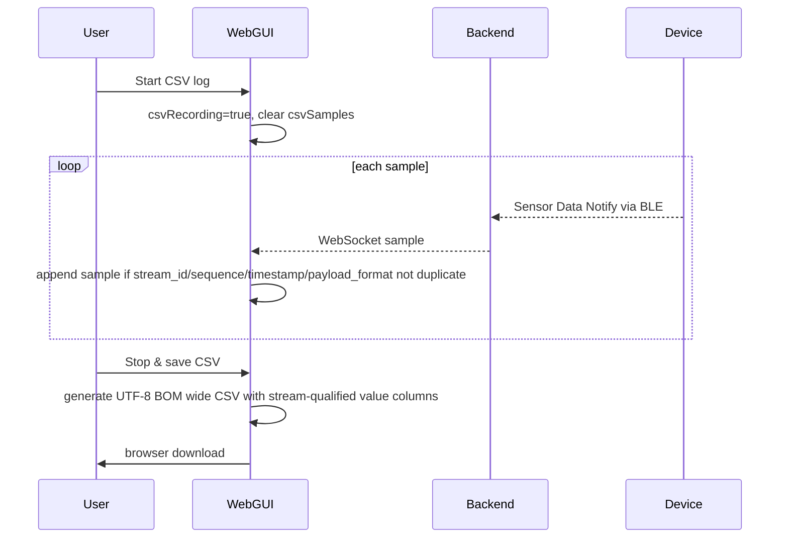

### 6.5 切断

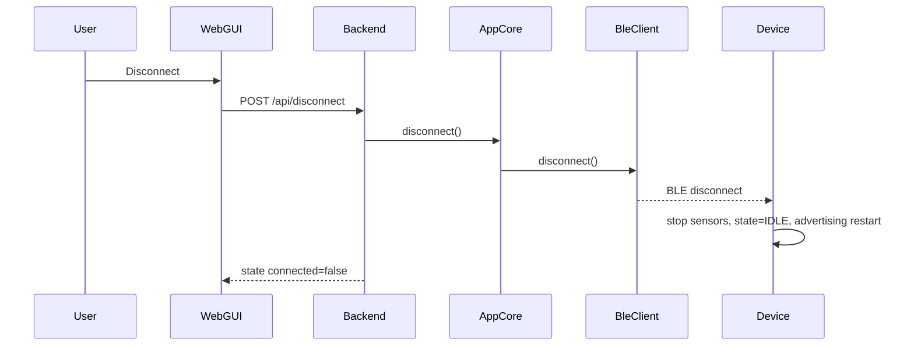

## 7. Error handling

| 場所 | 方針 |
| --- | --- |
| Firmware Control Write | payload長、version、commandを検証し、ATT errorと`last_error`へ反映 |
| Firmware Config Write | v4のop、stream_id、interval範囲、flags、reservedを検証し、不正時はATT errorと`INVALID_CONFIG` |
| Firmware Notify | 未接続/未購読ではエラーを返し、`last_error`を更新 |
| Python protocol | payload長、version、enum値を検証し、`ProtocolError` |
| Python BLE client | 未接続操作は`BleClientError` |
| Web API | 操作失敗はHTTP errorまたはJSON `{ ok: false, error: ... }` |
| WebGUI | toastでエラー表示 |

## 8. 互換性

- 現行FirmwareはProtocol v4を送信する。
- 試作段階のため、PC backendは旧Protocol v1/v2 Sensor Dataをparseしない。
- Control、Status、Capability、Sensor DataはProtocol v4、Config payloadはstream-scoped v4に対応する。
- Service UUIDは現行のまま維持し、payload versionで試作段階の破壊的変更を扱う。

## 9. 設計上の改善候補

| 項目 | 理由 |
| --- | --- |
| Capability metadata活用・拡張 | WebGUI/backendの固定field依存を減らす |
| stream単位Config拡張 | 現行v4は `stream_id=1` のinterval変更まで。enable/disableや実センサrate変更へ進める |
| Status Notify追加 | start/stop/config/errorのpush通知を可能にする |
| field単位metadata | 現行Capabilityはstream単位metadataまでなので、WebGUI/backendの固定field依存をさらに減らす |
| 追加stream化 | LSM303AGR accelなど、用途が明確になったsensorを `stream_id`付きframeで独立streamにする |
| Protocol層とBLE transport層のさらなる分離 | NUS/Serial transportへ展開しやすくする |
| `connection_count`責務整理 | BLE層とcontrol層の状態同期を明確にする |
