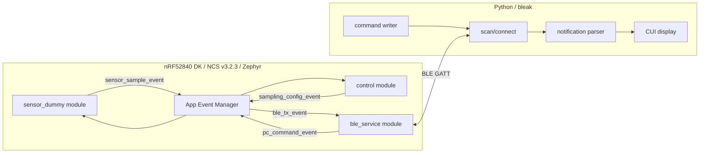

# BLE Sensor Logger: Phase 1-2 Design Specification and Development Plan

作成日: 2026-06-12

## 1. フェーズ1: 設計・調整結果

### 1.1 エージェント間合意事項

PMエージェントの初期案に対し、FW/App/QAエージェントが実装観点でレビューし、以下を合意仕様とする。

| 論点 | 合意内容 | 理由 |
| --- | --- | --- |
| BLEロール | デバイス: Peripheral / GATT Server、PC: Central / GATT Client | nRF52840からPCへセンサデータをPushし、PCから設定を書き込む要求に合う |
| センサ送信 | Notificationを標準、将来拡張でIndication対応余地を残す | リアルタイム性と実装容易性を優先。欠落検出はsequenceで行う |
| 制御方式 | Control characteristicへWrite | bleakから扱いやすく、コマンド拡張が容易 |
| 設定方式 | Config characteristicへWrite/Read | サンプリング周期などの状態確認が必要 |
| 初期ターゲット | nRF52840 DK (`nrf52840dk/nrf52840`) | 実機検証しやすく、NCS/Zephyr標準boardとして扱える |
| AEM依存範囲 | FWのアプリ層はAEM、BLE/センサ処理はポート層を薄く分離 | AEM以外への移植要求を満たす |
| DK依存制約 | nRF52840 DK専用API/NCSサンプル用ヘルパAPIは禁止 | 実ターゲット基板へ移植しやすい構成を維持する |
| データ表現 | Little Endian、固定長binary payload | Zephyr/C/Python間でパースしやすく、通信効率がよい |
| 時刻 | firmware boot後のuptime_ms | RTC同期が不要で初期実装に適する |
| 再接続 | PC側は自動再スキャン/再接続、FW側はadvertising再開 | E2E異常系試験の観点で明確 |

### 1.2 全体アーキテクチャ



## 2. BLE GATTプロファイル仕様

### 2.1 Advertising

| 項目 | 値 |
| --- | --- |
| Device Name | `BLE_SENSOR_LOGGER` |
| Primary Service UUID | `12345678-1234-5678-1234-56789abcdef0` |
| Advertising種別 | Connectable undirected advertising |
| Advertising再開 | disconnect後に自動再開 |

### 2.2 Service

| 名称 | UUID |
| --- | --- |
| Sensor Logger Service | `12345678-1234-5678-1234-56789abcdef0` |

### 2.3 Characteristics

| 名称 | UUID | Properties | 用途 |
| --- | --- | --- | --- |
| Sensor Data | `12345678-1234-5678-1234-56789abcdef1` | Notify, Read optional | センササンプル送信 |
| Control | `12345678-1234-5678-1234-56789abcdef2` | Write, Write Without Response optional | 計測開始/停止、即時要求 |
| Config | `12345678-1234-5678-1234-56789abcdef3` | Read, Write | サンプリング周期などの設定 |
| Status | `12345678-1234-5678-1234-56789abcdef4` | Read, Notify optional | 動作状態、エラー状態 |

UUIDは初期開発用の固定値とする。製品化時は組織管理の128-bit UUIDへ変更する。

## 3. Binary Payload仕様

### 3.1 共通ルール

| 項目 | 仕様 |
| --- | --- |
| Byte order | Little Endian |
| 整数 | 符号付き/符号なしを明記 |
| float | 初期版では使用しない。スケール付き整数で送る |
| バージョン | payload先頭に`version`を含める |
| 欠落検出 | `sequence`の連番で検出 |

### 3.2 Sensor Data payload

送信元: Device  
送信先: PC  
Characteristic: Sensor Data Notification

| Offset | Size | Type | Field | 説明 |
| --- | ---: | --- | --- | --- |
| 0 | 1 | uint8 | version | 現行値 `2` |
| 1 | 1 | uint8 | sensor_flags | bit0: accel有効、bit1: battery有効、bit2: ADC有効 |
| 2 | 2 | uint16 | sequence | 0から開始しwrap可 |
| 4 | 4 | uint32 | uptime_ms | boot後ミリ秒 |
| 8 | 2 | int16 | accel_x_mg | X軸加速度、単位mg |
| 10 | 2 | int16 | accel_y_mg | Y軸加速度、単位mg |
| 12 | 2 | int16 | accel_z_mg | Z軸加速度、単位mg |
| 14 | 2 | uint16 | battery_mv | バッテリ電圧、単位mV。未知時0 |
| 16 | 2 | int16 | adc_raw | Zephyr ADC APIで取得したraw値 |
| 18 | 2 | uint16 | adc_mv | ADC換算値、単位mV |

合計: 20 bytes。PC側は移行期間中、Protocol v1の16 bytes payloadもparse可能とする。

Python struct format:

```python
"<BBHIhhhHhH"
```

C構造体上はpackingを必須とし、static assertで20 bytesを検証する。

### 3.3 Control payload

送信元: PC  
送信先: Device  
Characteristic: Control Write

| Offset | Size | Type | Field | 説明 |
| --- | ---: | --- | --- | --- |
| 0 | 1 | uint8 | version | 現行値 `2` |
| 1 | 1 | uint8 | command | 下表 |
| 2 | 2 | uint16 | value | コマンド引数 |

合計: 4 bytes

Command:

| 値 | 名称 | value |
| ---: | --- | --- |
| 0x01 | START_MEASUREMENT | 0 |
| 0x02 | STOP_MEASUREMENT | 0 |
| 0x03 | REQUEST_STATUS | 0 |
| 0x04 | RESET_SEQUENCE | 0 |

Python struct format:

```python
"<BBH"
```

### 3.4 Config payload

送信元: PC  
送信先: Device  
Characteristic: Config Read/Write

| Offset | Size | Type | Field | 説明 |
| --- | ---: | --- | --- | --- |
| 0 | 1 | uint8 | version | 現行値 `2` |
| 1 | 1 | uint8 | flags | bit0: auto_start |
| 2 | 2 | uint16 | sample_interval_ms | 20-10000 ms |
| 4 | 2 | uint16 | notify_interval_ms | 20-10000 ms、初期版ではsample_intervalと同一運用可 |
| 6 | 2 | uint16 | reserved | 0固定 |

合計: 8 bytes

Python struct format:

```python
"<BBHHH"
```

設定範囲外の値はFW側で拒否し、Statusのlast_errorへ反映する。Write応答がある場合はATT errorを返す。

### 3.5 Status payload

送信元: Device  
送信先: PC  
Characteristic: Status Read / optional Notification

| Offset | Size | Type | Field | 説明 |
| --- | ---: | --- | --- | --- |
| 0 | 1 | uint8 | version | 現行値 `2` |
| 1 | 1 | uint8 | state | 0: idle, 1: measuring, 2: error |
| 2 | 2 | uint16 | sample_interval_ms | 現在設定 |
| 4 | 2 | uint16 | last_error | 0: none、下表 |
| 6 | 2 | uint16 | connection_count | 接続回数 |

合計: 8 bytes

Error:

| 値 | 名称 |
| ---: | --- |
| 0 | NONE |
| 1 | INVALID_VERSION |
| 2 | INVALID_LENGTH |
| 3 | INVALID_COMMAND |
| 4 | INVALID_CONFIG |
| 5 | NOT_CONNECTED |
| 6 | NOT_SUBSCRIBED |

## 4. ファームウェア設計方針

### 4.1 ターゲットボードと依存制約

初期ターゲットはnRF52840 DKとし、Zephyr board targetは`nrf52840dk/nrf52840`を想定する。

ただし、移植性を優先し、NCSに含まれるDK専用API、NCSサンプル用のboard helper、DKのボタン/LED配置に直接依存するAPIは使用しない。ハードウェア依存が必要な場合は、Zephyr標準API、Devicetree alias/chosen、Kconfig、薄いplatform adapterを経由する。

| 項目 | 方針 |
| --- | --- |
| Build target | `nrf52840dk/nrf52840` |
| GPIO/LED/Button | 初期版では必須機能にしない。必要時はZephyr GPIO API + Devicetree経由 |
| BLE | Zephyr Bluetooth APIを使用 |
| 時刻 | Zephyr kernel uptime APIをplatform adapter経由で使用 |
| センサ | 初期版はdummy sensor。実センサ追加時はZephyr sensor APIまたは独立driver adapterを使用 |
| 禁止 | DK専用ヘルパAPI、NCSサンプル固有のboard control API、ピン番号直書き |

### 4.2 モジュール分割

| モジュール | 役割 | AEM依存 |
| --- | --- | --- |
| `main` | 初期化、AEM起動 | あり |
| `events` | AEMイベント定義 | あり |
| `sensor_dummy` | dummy sensor値生成、周期タイマ管理 | 薄い |
| `control` | 設定/コマンドを状態遷移へ変換 | あり |
| `ble_service` | GATT定義、advertising、Notification/Write callback | Zephyr BLE依存 |
| `protocol` | payload pack/unpack、範囲チェック | なし |
| `platform_time` | uptime取得 | Zephyr依存 |

### 4.3 AEMイベント案

| Event | Publisher | Subscriber | Payload |
| --- | --- | --- | --- |
| `sensor_sample_event` | `sensor_dummy` | `ble_service` | sequence, uptime, accel, battery |
| `ble_ready_event` | `ble_service` | `control` | advertising状態 |
| `ble_connected_event` | `ble_service` | `control` | conn id |
| `ble_disconnected_event` | `ble_service` | `control`, `sensor_dummy` | reason |
| `pc_command_event` | `ble_service` | `control` | command, value |
| `config_update_event` | `ble_service`/`control` | `sensor_dummy`, `ble_service` | interval, flags |
| `status_update_event` | `control` | `ble_service` | state, error |

### 4.4 移植性ルール

- `protocol`はZephyr/AEMヘッダをincludeしない。
- BLE callback内で重い処理を行わず、AEMイベントへ変換する。
- センサ実装はdummyから実デバイスドライバへ差し替え可能にする。
- nRF52840 DKは初期検証ボードとして扱い、アプリロジックをDK固有APIへ依存させない。
- GPIOなどのboard依存が必要な場合はDevicetree/Kconfig/platform adapterに閉じ込める。
- AEM非採用環境では、event publish/subscribe層をadapterで置き換える。

## 5. PCアプリ設計方針

### 5.1 アプリ構成方針

初期版のUIはCUIとする。ただし将来のWebGUI化を前提に、BLE接続・プロトコル変換・アプリ状態管理をUIから分離する。

WebGUI化時もBLE通信はブラウザ側に持たせない。ブラウザは表示・操作のみを担当し、BLE scan/connect/notify/write/reconnectはPythonバックエンド側の`ble_client`が引き続き担当する。WebGUIとPythonバックエンドの間は、ローカルHTTP APIとWebSocket/SSEなどのイベント配信で接続する。

| レイヤ | 役割 | WebGUI化時の扱い |
| --- | --- | --- |
| `protocol` | binary payloadのpack/unpack、定数定義 | そのまま再利用 |
| `ble_client` | bleakによるscan/connect/discover/notify/write/reconnect | そのまま再利用 |
| `app_core` | 状態管理、コマンド実行、受信データ配信 | そのまま再利用 |
| `ui_shell` | 対話式CUI、コマンド入力、テキスト表示 | WebGUIとは別UIとして残せる |
| `web_api` | local HTTP API、WebSocket配信 | `app_core`を呼び出す |
| `web_frontend` | WebGUI表示/操作、リアルタイムグラフ | BLEへ直接アクセスしない |

WebGUI化時にBLE処理を書き直さないこと、ブラウザ実装でWeb Bluetooth APIを使わないことを設計制約とする。CUI/WebGUIはどちらも`app_core`の公開APIを通じて操作する。

### 5.2 初期版の機能

| 機能 | 内容 |
| --- | --- |
| Scan | service UUIDまたはdevice nameで探索 |
| Connect | 対象Peripheralへ接続 |
| Discover | 必要characteristicの存在確認 |
| Subscribe | Sensor Data Notification購読 |
| Display | sequence, uptime, accel, battery, intervalをCUI表示 |
| Command | `start`, `stop`, `status`, `reset-seq` |
| Config | `set-interval <ms>` |
| Reconnect | 切断時に再スキャン/再接続 |

### 5.3 CUI操作案

初期版は、アプリ起動後に対話式シェルを開く。ユーザーは毎回`python -m ble_sensor_logger ...`を呼ばず、同一ターミナルセッション内で`scan`、`monitor`などの短いコマンドを入力する。

```bash
python -m ble_sensor_logger

ble-sensor> scan
ble-sensor> connect BLE_SENSOR_LOGGER
ble-sensor> monitor
ble-sensor> start
ble-sensor> set-interval 100
ble-sensor> status
ble-sensor> stop
ble-sensor> exit
```

単発実行も自動テストやスクリプト連携用に残してよい。

```bash
python -m ble_sensor_logger --once scan
python -m ble_sensor_logger --once monitor --name BLE_SENSOR_LOGGER --interval 100
```

対話式シェルで扱う初期コマンド:

| コマンド | 内容 |
| --- | --- |
| `scan` | 対象デバイスを探索 |
| `connect [name_or_address]` | デバイスへ接続 |
| `disconnect` | 明示切断 |
| `monitor` | Notification表示を開始 |
| `start` | 計測開始 |
| `stop` | 計測停止 |
| `set-interval <ms>` | sampling intervalを変更 |
| `status` | Status characteristicをRead |
| `reset-seq` | sequenceをリセット |
| `exit` | アプリ終了 |

## 6. QA観点での受け入れ基準

| 項目 | 受け入れ基準 |
| --- | --- |
| 接続 | PCからdevice nameまたはservice UUIDで接続できる |
| Notification | 100 ms周期設定時、10秒間で概ね100サンプル受信できる |
| Sequence | 欠番が検出・表示できる |
| 設定変更 | PCからinterval変更後、FWの送信周期が変化する |
| Start/Stop | stop後はNotificationが停止し、start後に再開する |
| Status | Readで現在状態とlast_errorが取得できる |
| 切断復帰 | PCアプリが切断を検知し、再接続できる |
| 不正Write | 不正長/範囲外設定でFWがクラッシュせずlast_errorを更新する |

## 7. フェーズ2: 詳細開発計画

### 7.1 マイルストーン

| Milestone | 期間目安 | 完了条件 |
| --- | --- | --- |
| M0: Project scaffold | 0.5日 | FW/App/Docs/Testのディレクトリとビルド雛形がある |
| M1: Protocol fixed | 0.5日 | C/Python双方のpayload定義と単体テストが通る |
| M2: FW BLE skeleton | 1.0日 | nRF52840 DK (`nrf52840dk/nrf52840`) でadvertisingし、GATT serviceが見える |
| M3: FW event pipeline | 1.0日 | dummy sensor -> AEM -> BLE notificationが動く |
| M4: PC interactive monitor | 1.0日 | 対話式CUIでscan/connect/monitorを実行しNotificationを表示できる |
| M5: Control/config | 1.0日 | start/stop/interval/statusがE2Eで動く |
| M6: QA hardening | 1.0日 | 正常系/異常系テスト、README、テスト仕様書が揃う |

合計目安: 6日

### 7.2 WBS

| ID | タスク | 担当 | 成果物 | 依存 |
| --- | --- | --- | --- | --- |
| 1.1 | リポジトリ構成定義 | PM | ディレクトリ構成、README初版 | なし |
| 1.2 | GATT仕様確定 | PM/FW/App/QA | 本仕様書 | なし |
| 1.3 | Protocol header実装 | FW | `protocol.h/.c` | 1.2 |
| 1.4 | Protocol Python実装 | App | `protocol.py` | 1.2 |
| 1.5 | Protocol単体テスト | QA | C/Python payloadテスト | 1.3, 1.4 |
| 2.1 | NCS project scaffold | FW | `prj.conf`, `CMakeLists.txt`, `nrf52840dk/nrf52840`向けboard設定 | 1.1 |
| 2.2 | BLE service実装 | FW | GATT定義、advertising | 1.3, 2.1 |
| 2.3 | AEM event定義 | FW | event headers/sources | 2.1 |
| 2.4 | dummy sensor実装 | FW | 周期timer、sample event | 2.3 |
| 2.5 | BLE notification連携 | FW | sample event -> notify | 2.2, 2.4 |
| 3.1 | Python package scaffold | App | `pyproject.toml`, package構成 | 1.1 |
| 3.2 | BLE client core実装 | App | scan/connect/discover/reconnectを含む`ble_client` | 3.1 |
| 3.3 | App core実装 | App | UI非依存の状態管理、通知配信、コマンドAPI | 1.4, 3.2 |
| 3.4 | 対話式CUI実装 | App | `scan`, `monitor`, `start`, `stop`, `set-interval`, `status`を受け付けるshell | 3.3 |
| 3.5 | Write command/config実装 | App | app core経由のcommand/config writer | 1.4, 3.3 |
| 4.1 | 正常系テスト設計 | QA | test cases | 1.2 |
| 4.2 | 異常系テスト設計 | QA | test cases | 1.2 |
| 4.3 | E2E手順書 | QA | manual E2E test spec | 2.5, 3.4 |
| 4.4 | レビュー | QA | code review checklist | 2.5, 3.4 |

### 7.3 推奨ディレクトリ構成

```text
.
├── docs/
│   ├── phase1_2_ble_spec_and_plan.md
│   └── test_spec.md
├── firmware/
│   ├── CMakeLists.txt
│   ├── prj.conf
│   ├── boards/
│   └── src/
│       ├── main.c
│       ├── events/
│       ├── modules/
│       └── protocol/
├── pc_app/
│   ├── pyproject.toml
│   ├── src/ble_sensor_logger/
│   │   ├── app_core.py
│   │   ├── ble_client.py
│   │   ├── protocol.py
│   │   ├── ui_shell.py
│   │   ├── web_api.py
│   │   └── __main__.py
│   ├── web_frontend/
│   └── tests/
└── README.md
```

### 7.4 リスクと対策

| リスク | 影響 | 対策 |
| --- | --- | --- |
| NCS v3.2.3でAEM設定が不足 | FW build不可 | scaffold時にAEM最小サンプルを先に通す |
| nRF52840 DK専用APIへの依存 | 実ターゲット基板への移植コスト増 | Zephyr標準API、Devicetree、platform adapterのみを許可する |
| PC OSごとのBLE挙動差 | 接続/再接続が不安定 | bleak backend差分をログ化し、macOS/Windows/Linux別注意をREADME化 |
| Notification周期が短すぎる | 欠落やATT congestion | 初期下限20 ms、標準100 ms。送信失敗時はdrop count検討 |
| binary layout不一致 | パース失敗 | C static assertとPython unit testで同一fixtureを使う |
| Indication要求への変更 | 設計変更 | characteristic設計はNotification標準、Indication optionalとして余地を残す |

### 7.5 フェーズ3開始前チェックリスト

- [ ] UUIDとpayload layoutが本仕様で固定されている
- [ ] firmwareのtarget boardは`nrf52840dk/nrf52840`とする
- [ ] DK専用API/NCSサンプル用board helper/ピン番号直書きを使わない
- [ ] 実センサ有無を決める。未定ならdummy sensorで開始する
- [ ] PCアプリ初期UIを対話式CUIで進め、WebGUI化に備えてcore層/API層/UI層を分離する
- [ ] WebGUI化時もBLE通信をブラウザ側へ持たせず、Pythonバックエンド経由にする方針を維持する
- [ ] E2E試験に使うPC OSを決める

## 8. 次フェーズへの入力

フェーズ3では以下を実装対象とする。

1. `firmware/`にNCS v3.2.3向けZephyrプロジェクトを作成する。
2. `protocol`をC/Pythonで実装し、payload fixtureを共有する。
3. AEMイベント定義とdummy sensor pipelineを構築する。
4. BLE GATT serviceを実装し、Sensor Data NotificationとControl/Config Writeを接続する。
5. `pc_app/`にbleakベースのcore層と、起動後に`scan`/`monitor`等を入力できる対話式CUIを実装する。将来のWebGUIはPythonバックエンドのローカルAPI経由でこのcore層を利用する。
6. `docs/test_spec.md`にQAテスト仕様を作成する。
